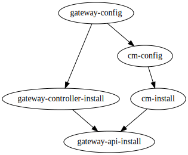

# Deploy and Setup Cert-manager and Gateway

## Goals

This Terragrunt workflow deploys and configures cert-manager, [Gateway API](https://github.com/kubernetes-sigs/gateway-api/) and [Gateway Controller](https://gateway-api.sigs.k8s.io/guides/getting-started/#installing-a-gateway-controller) to an existing Kubernetes cluster.

[Contour Gateway Controller](https://projectcontour.io/guides/gateway-api/) will be installed by default.

An `Issuer` named `gateway-issuer` in default `gateway-demo` namespace will be created that can issue certificates to gateway. 

> Note: by default, the type of `gateway-issuer` is `ACME`, you need to configure your own `acme_email`. If you only test it in the local Kubernetes environment, you can set `issuer_type = "SelfSignedCA"` and `"envoy.service.type" = "NodePort"`.

A `GatewayClass` named `cm-testing-gateway` will be created that use `projectcontour.io/projectcontour/contour` controller by default.

A `Gateway` named `cm-testing-gateway` in default `gateway-demo` namespace will be created that will use a tls certificate issued by `gateway-issuer`.

## Dependencies Graph

Terragrunt is used to ensure the correct order of dependency installation, i.e that cert-manager `Issuer` is not created before installing cert-manager. See dependency graph below:



### gateway-api-install

To install Gateway into Kubernetes, you need to set `kubeconfig_path` that default is `~/.kube/config`.

### cm-install

To use [Helm Provider](https://registry.terraform.io/providers/hashicorp/helm/latest/docs) to install Cert-Manager into Kubernetes, you need to set `kubeconfig_path` that default is `~/.kube/config`.

### gateway-controller-install

To install [Gateway Controller](https://gateway-api.sigs.k8s.io/guides/getting-started/#installing-a-gateway-controller) into Kubernetes. By default, it will deploy [Contour](https://projectcontour.io/guides/gateway-api/).

### cm-config

By default, it will create a `Gateway` named `gateway-acmesolver` in default `gateway-demo` namespace that would forward plain HTTP traffic from all routes and that cert-manager could use to attach the `HTTPRoute` it creates for the `Challenge`. And create an `Issuer` named `gateway-issuer` that use configured `ACME` to issue certificates to gateway.

If you set `issuer_type = "SelfSignedCA"`, it will create a `Issuer` named `selfsigned-issuer` that can issue CA certs named `selfsigned-ca-tls` in default `gateway-demo` namespace, and create an `Issuer` named `gateway-issuer` that can issue certificates to gateway.

### gateway-config

To use Kubernetes Provider to configure Gateway. By default, it create `GatewayClass` named `cm-testing-gateway` that use `projectcontour.io/projectcontour/contour` and a `Gateway` named `cm-testing-gateway` in default `gateway-demo` namespace that will use a tls certificate issued by `gateway-issuer`.

## Usage Steps

### 1. Execute `terragrunt run-all init` to init providers of all modules.

### 2. Configurate custom variable.

You can configurate custom variables in `common.tfvars`.

```
# Path to the kubeconfig file to use for connecting kubernetes cluster. Default is "~/.kube/config"
kubeconfig_path = "~/.kube/config"

# Cert-manger version to install. Default is "v1.10.0"
cm_version = "v1.10.0"

# Contour version to install. Default is "7.10.2" that is Contour Helm version corresponding to Contour version "1.20.1".
# You can check the mapping between the Contour Helm version and the Contour APP version by executing `helm search repo bitnami/contour -l`
contour_version = "7.10.2"

# The arguments will be passed to the cm-manager helm values
cm_arguments = {
  installCRDs = "true"
  extraArgs   = "{--feature-gates=ExperimentalGatewayAPISupport=true}"
}

# Namespace that demo is installed. Default is "gateway-demo"
demo_namespace = "gateway-demo"

# Issuer that issue certificates to gateway. Default is "gateway-issuer"
issuer_name = "gateway-issuer"

# Hostname that demo gateway to use. Default is "example.com"
gateway_hostname = "example.com"

# Name of testing gateway. Default is "cm-testing-gateway"
gateway_name = "cm-testing-gateway"


# The following parameters must be used in combination
# 1. issuer_type is "SelfSignedCA" and envoy.service.type is "NodePort", which can be tested in a local kind environment.
# 2. issuer_type is "ACME" and envoy.service.type is "LoadBalancer", which can be tested in a cloud environment such as GKE.

# Type of Issuer that is used to issue certificates. Default is "ACME", the other is "SelfSignedCA"
issuer_type = "ACME"

# The arguments will be passed to the contour helm values
contour_arguments = {
  # The service type of envoy. Default is "LoadBalancer", the other is "NodePort"
  "envoy.service.type" = "LoadBalancer"

  # IP address to assign to load balancer when using "LoadBalancer" type (if supported)
  # "envoy.service.loadBalancerIP" = "<my-static-ip>"
}

# The email of "letsencrypt" ACME issuer. Must be a valid email if you set `issuer_type = "ACME"`
acme_email = "test@example.com"
......
```

### 3. Execute `terragrunt run-all apply` to deploy all modules.

### 4. Execute `terragrunt run-all destroy` to clean test environment.
