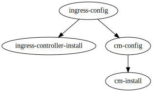

# Deploy and Setup Cert-manager and Ingress

## Goals

This Terragrunt workflow deploys and configures cert-manager and [Ingress Controller](https://kubernetes.io/docs/concepts/services-networking/ingress-controllers/) to an existing Kubernetes cluster.

[Ingress NGINX Controller](https://kubernetes.github.io/ingress-nginx/deploy/#quick-start) will be installed by default.

An `Issuer` named `ingress-issuer` in default `ingress-demo` namespace will be created that can issue certificates to ingress.

> Note: by default, the type of `ingress-issuer` is `ACME`, you need to configure your own `acme_email`. If you only test it in the local Kubernetes environment, you can set `issuer_type = "SelfSignedCA"` and `controller.service.type = "ClusterIP"`.

An `Ingress` named `cm-testing-ingress` in default `ingress-demo` namespace will be created that will use a tls certificate issued by `ingress-issuer`.

## Dependencies Graph

Terragrunt is used to ensure the correct order of dependency installation, i.e that cert-manager `Issuer` is not created before installing cert-manager. See dependency graph below:



### cm-install

To use [Helm Provider](https://registry.terraform.io/providers/hashicorp/helm/latest/docs) to install Cert-Manager into Kubernetes, you need to set `kubeconfig_path` that default is `~/.kube/config`.

### ingress-controller-install

To install [Ingress Controller](https://kubernetes.io/docs/concepts/services-networking/ingress-controllers/) into Kubernetes. By default, it will deploy [Ingress NGINX Controller](https://kubernetes.github.io/ingress-nginx/deploy/#quick-start).

### cm-config

By default, it will create an `Issuer` named `ingress-issuer` that use configured `ACME` to issue certificates to ingress.

If you set `issuer_type = "SelfSignedCA"`, it create a `Issuer` named `selfsigned-issuer ` that can issue CA certs named `selfsigned-ca-tls` in the namespace, and create an `Issuer` named `ingress-issuer` that can issue certificates to ingress.

### ingress-config

To use Kubernetes Provider to configure Ingress. By default, it create an `Ingress` named `cm-testing-ingress` in default `ingress-demo` namespace that will use a tls certificate issued by `ingress-issuer`.

You can specify a real backend service for `cm-testing-ingress` by setting `ingress_backend_service` and `ingress_backend_service_port` to test the ingress. For example, you can deploy a [kuard backend service](https://cert-manager.io/docs/tutorials/acme/nginx-ingress/#step-4---deploy-an-example-service).

## Usage Steps

### 1. Execute `terragrunt run-all init` to init providers of all modules.

### 2. Configurate custom variable.

You can configurate custom variables in `common.tfvars`.

```
# Path to the kubeconfig file to use for connecting kubernetes cluster. Default is "~/.kube/config"
kubeconfig_path = "~/.kube/config"

# Cert-manger version to install. Default is "v1.10.0"
cm_version = "v1.10.0"

# Ingress-nginx version to install. Default is "4.2.3" that is Ingress-nginx Helm version corresponding to Ingress-nginx version "1.3.0".
# You can check the mapping between the Ingress-nginx Helm version and the Ingress-nginx APP version by executing `helm search repo ingress-nginx/ingress-nginx -l`
ingress_nginx_version = "4.2.3"

# Namespace that demo is installed. Default is "ingress-demo"
demo_namespace = "ingress-demo"

# Issuer that issue certificates to ingress. Default is "ingress-issuer"
issuer_name = "ingress-issuer"

# The arguments will be passed to the cm-manager helm values
cm_arguments = {
  installCRDs = "true"
}

# The following parameters must be used in combination
# 1. issuer_type is "SelfSignedCA" and controller.service.type is "ClusterIP", which can be tested in a local kind environment.
# 2. issuer_type is "ACME" and controller.service.type is "LoadBalancer", which can be tested in a cloud environment such as GKE.

# Type of Issuer that is used to issue certificates. Default is "ACME", the other is "SelfSignedCA"
issuer_type = "ACME"

# The arguments will be passed to the ingress-nginx helm values
ingress_nginx_arguments = {
  # The service type of ingress-nginx-controller. Default is "LoadBalancer", the other is "ClusterIP"
  "controller.service.type"              = "LoadBalancer"
  # IP address to assign to load balancer when using "LoadBalancer" type (if supported)
  # "controller.service.loadBalancerIP" = "<my-static-ip>"
  
  "controller.image.digest"              = ""
  "admissionWebhooks.enabled"            = false
  "controller.admissionWebhooks.enabled" = true
  "controller.watchIngressWithoutClass"  = true
}

# The email of "letsencrypt" ACME issuer. Must be a valid email if you set `issuer_type = "ACME"`
acme_email = "test@example.com"

# Hostname that demo ingress to use. Default is "example.com"
ingress_hostname = "example.com"

# You can specify a real backend service by setting `ingress_backend_service` and `ingress_backend_service_port`.
# For example, you can deploy a kuard backend service referring to https://cert-manager.io/docs/tutorials/acme/nginx-ingress/#step-4---deploy-an-example-service
ingress_backend_service = "ingress-test-service"

# The port of backend service.
ingress_backend_service_port = 80
......
```

### 3. Execute `terragrunt run-all apply` to deploy all modules.

### 4. Execute `terragrunt run-all destroy` to clean test environment.
