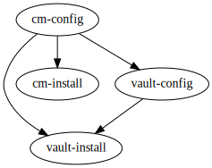

# Deploy and Setup Cert-manager and Vault

## Goals

This Terragrunt workflow deploys and configures cert-manager, Hashicorp Vault and a cert-manager Vault `ClusterIssuer` to an existing Kubernetes cluster.

Vault will be deployed in the insecure dev mode with a [PKI Secrets Engine](https://www.vaultproject.io/docs/secrets/pki) configured for issuing certs for `cert-manager.io` subdomains.

A `ClusterIssuer` named `vault-issuer` will be created that can issue certs from this PKI using Vault's dev root token.

A `Certificate` named `demo-app-vault-cert` will be created that issued by `vault-issuer`.

> Note: The allowed DNS names are restricted to subdomains of `cert-manager.io`.

## Dependencies Graph

Terragrunt is used to ensure the correct order of dependency installation, i.e that cert-manager `ClusterIssuer` is not created before installing cert-manager. See dependency graph below:



### cm-install

To use [Helm Provider](https://registry.terraform.io/providers/hashicorp/helm/latest/docs) to install Cert-Manager into Kubernetes, you need to set `kubeconfig_path` that default is `~/.kube/config`.

### vault-install

To use Helm Provider to install Vault into Kubernetes. By default, it is a single unsealed Vault server in the insecure dev mode with a memory storage backend.

### vault-config

To use Vault Provider to configure Vault. By default, it setup a [PKI Secrets Engine](https://www.vaultproject.io/docs/secrets/pki) configured for issuing certs for `cert-manager.io` subdomains.

### cm-config

To use Kubernetes Provider to configure Cert-Manager. By default, it create a `ClusterIssuer` named `vault-issuer` that can issue certs from this PKI using Vault's dev root token and a `Certificate` named `demo-app-vault-cert` that issued by `vault-issuer`.


## Usage Steps

### 1. Execute `terragrunt run-all init` to init providers of all modules.

### 2. Configurate custom variable.

You can configurate custom variables in `common.tfvars`.

```
# Path to the kubeconfig file to use for connecting kubernetes cluster. Default is "~/.kube/config"
kubeconfig_path="~/.kube/config"
......
```

### 3. Execute `terragrunt run-all apply` to deploy all modules.

### 4. Execute `terragrunt run-all destroy` to clean test environment.

### Note
If you want to run it in [Kind](https://kind.sigs.k8s.io/) cluster, you need to [create extra port mappings](https://kind.sigs.k8s.io/docs/user/configuration/#extra-port-mappings) to `vault-install` module to port forward.

To use this config, place the contents in a file `config.yaml` and then run `kind create cluster --config=config.yaml` from the same directory.

```
apiVersion: kind.x-k8s.io/v1alpha4
kind: Cluster
nodes:
- role: control-plane
  extraPortMappings:
  - containerPort: 30200
    hostPort: 30200
```
